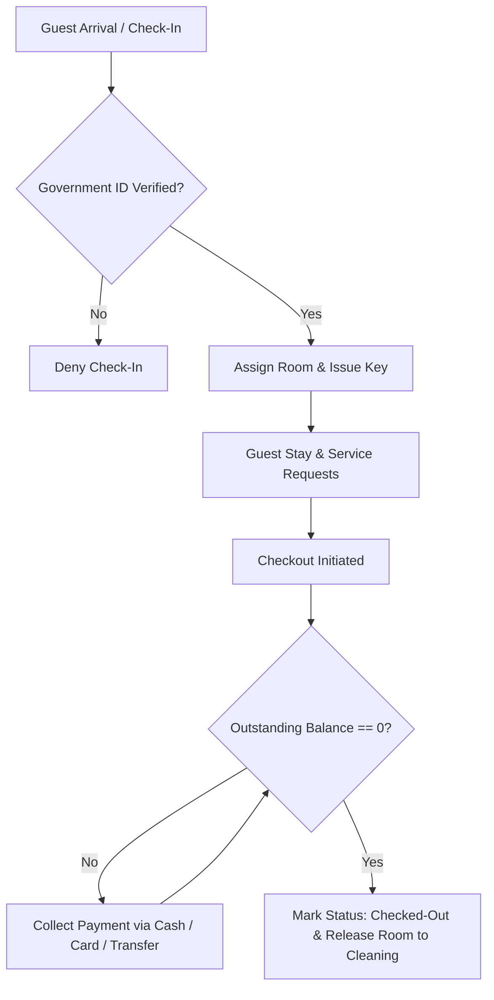

# System Scenario Analysis & Requirements Specification
## Hotel Reservation and Guest Services Management System (HRGSMS)
**Client:** SkyNest Hotels (Colombo, Kandy, Galle)  
**Document Version:** 1.1  
**Target Architecture:** Database-Centric Multi-Branch Web Application  
**Related Documents:** [UI/UX & Frontend Architecture Analysis](file:///Users/akashinduwara/micro%20maze/HOTEL%20BILLING%20Database%20/HRGSMS_UI_UX_Analysis.md)  

---

## 1. Executive Summary & Problem Context

SkyNest Hotels is a premier regional hotel chain operating across Sri Lanka with properties in **Colombo**, **Kandy**, and **Galle**. The organization currently relies on an legacy desktop-based management system that presents major operational bottlenecks:

- **Frequent Overbookings:** Lack of real-time multi-branch synchronization allows double-booking of rooms during peak seasons.
- **Billing Delays & Errors:** Manual calculation of room rates, seasonal surcharges, and add-on guest services leads to revenue leakage and guest friction.
- **Service Tracking Deficits:** Inability to seamlessly log and fulfill guest requests (spa, room service, laundry, minibar) across departments.
- **Siloed Reporting:** Management lacks centralized insights into occupancy trends, branch performance, and guest preference analytics.

To solve these challenges, SkyNest Hotels is commissioning the **Hotel Reservation and Guest Services Management System (HRGSMS)**—a centralized, real-time, web-based platform with robust multi-tenant role-based access control (RBAC), database-driven business logic, and automated payment/billing integrations.

---

## 2. Core Stakeholders & User Persona Mapping

The HRGSMS accommodates five distinct user classes, each with tailored access permissions and workflow interfaces:

| User Class | Scope of Access | Primary Responsibilities & Key Actions |
| :--- | :--- | :--- |
| **System Administrator** | System-Wide (All Branches) | System configuration, global user account creation, security logging audit, third-party integrations (Stripe, Twilio, Channel Managers). |
| **Branch Manager** | Branch-Specific (Cross-branch read) | Managing local room inventory, updating service catalogs, adjusting pricing/rates, generating branch financial & occupancy reports. |
| **Front Desk Staff** | Assigned Branch | Handling walk-in/online reservations, guest check-in/check-out, guest ID verification, collecting payments, resolving billing queries. |
| **Service Staff** | Assigned Branch / Department | Receiving and fulfilling guest service requests (Room Service, Housekeeping, Spa, Minibar), marking task completion, updating service charges. |
| **Guest (Portal User)** | Personal Booking Scope | Viewing reservation details, submitting service requests during stay, reviewing itemized bills, online checkout payments. |

---

## 3. High-Level System Architecture & Technology Stack

The HRGSMS is designed around a **modular, database-centric, multi-tier architecture** ensuring high availability, strong data consistency, and real-time responsiveness.

```
+-----------------------------------------------------------------------+
|                            FRONTEND TIER                              |
|   React (Vite) + TypeScript + Tailwind CSS                            |
|   Role-Based Dashboards (Guest, Front Desk, Manager, Admin)           |
+-----------------------------------+-----------------------------------+
                                    | RESTful APIs / WebSockets / SSE
+-----------------------------------v-----------------------------------+
|                            BACKEND TIER                               |
|   Node.js / Express REST API Engine + Socket.io Server                 |
|   Middleware: Auth (JWT/MFA), RBAC, Branch Scoping, Audit Logging     |
+-----------------------------------+-----------------------------------+
                                    | Prisma ORM / SQL Drivers
+-----------------------------------v-----------------------------------+
|                           DATABASE TIER                               |
|   MySQL 8.1.0 Relational DB (ACID Compliant, Real-time Sync)          |
+-----------------------------------------------------------------------+
                                    | Integrations
+-----------------------------------v-----------------------------------+
|                        EXTERNAL SERVICES                              |
|   Stripe (Payment Processing) | Twilio (SMS/Email) | Channel Managers |
+-----------------------------------------------------------------------+
```

---

## 4. UI/UX & Interactive Layout Integration

The system interface design has been fully specified across three core user management views:

### 4.1 Executive Branch Overview Dashboard (`/manager/dashboard`)
- **Key Metrics Summary:** Real-time occupancy percentage ($85\%$), active bookings count ($42$), and daily revenue ($12,400$) with trend sparklines.
- **Branch Performance Cards:** Comparative performance indicators for Colombo ($92\%$ occupancy) and Kandy ($78\%$ occupancy), tracking daily arrivals and departures.
- **Live Activity Feed:** Real-time stream of hotel operational events (check-ins, service requests, penthouse bookings).

### 4.2 Room Bookings & Availability Matrix (`/frontdesk/availability`)
- **Interactive Timeline Grid:** Visual grid organizing rooms ($S-401, S-402, D-301, D-302$) against daily calendar columns.
- **Color-Coded Status Spans:**
  - **Navy (`#00152f`):** Booked / Reserved
  - **Slate Blue (`#485f82`):** Checked-In
  - **Gold (`#fed65b`):** Maintenance / Out-of-Order
  - **Light Blue (`#e7eeff`):** Available
- **Reservation Modal:** Multi-step wizard collecting guest details, stay duration, category selection, tax calculations, and guarantee payment details.

### 4.3 Guest Services & Operations Queue (`/frontdesk/services`)
- **Live Queue Cards:** Horizontal cards displaying real-time service requests (Room Service, Spa, Airport Transfer) categorized by status (`Pending`, `In-Progress`, `Completed`).
- **Active Guest Folio List:** Table tracking active guests, check-out dates, accumulated charges, and quick service addition buttons (`+ Add`).
- **Service Catalogue Panel:** Centralized catalog management for itemized services and standard pricing.

For a full deep-dive into UI components, color palettes, and API data bindings, view [HRGSMS_UI_UX_Analysis.md](file:///Users/akashinduwara/micro%20maze/HOTEL%20BILLING%20Database%20/HRGSMS_UI_UX_Analysis.md).

---

## 5. Functional Modules Analysis

### 5.1 User Authentication & Access Control
- **Unified Login Portal:** Single login entry point redirecting users dynamically based on role and assigned branch.
- **Security Enforcements:**
  - Password policies (min 10 chars, uppercase, number, special char).
  - Account lockout (15-minute lock after 5 consecutive failed attempts).
  - Idle session timeout (15 minutes).
  - Multi-Factor Authentication (MFA via TOTP/SMS) for privileged actions and administrative roles.
- **Audit Logging:** Full audit trail logging user actions, timestamp, IP, and data state changes (before/after).

### 5.2 Room Reservation Management
- **Real-Time Inventory & Availability:** Live availability engine enforcing strict concurrency controls to eliminate double-booking.
- **Reservation Lifecycle:**
  - Draft -> Confirmed -> Checked-In -> Checked-Out / Cancelled.
- **Room & Structure Control:** Flexible room category definitions (Single, Double, Suite, Deluxe) decoupled from physical room numbers per branch.
- **Guest Custom Attributes:** Dynamic metadata fields (e.g., Loyalty Tier, Dietary Restrictions, VIP Status).

### 5.3 Guest Services Management
- **Predefined Service Catalog:** Standardized catalog supporting branch-specific price variants for:
  1. Room Service (Food & Beverage)
  2. Spa Treatments
  3. Laundry Services
  4. Minibar Consumption
  5. Airport Transportation & Tours
- **Real-time Order Workflow:** Guests submit requests -> Routed to department service staff -> Staff marks as fulfilled -> Charges automatically posted to guest's folio.

### 5.4 Billing & Payment Processing
- **Automated Folio Calculation:**
  $$\text{Total Bill} = (\text{Room Rate} \times \text{Nights}) + \sum \text{Service Charges} + \text{Applicable Taxes}$$
- **Payment Lifecycle:**
  - Supports Cash, Credit Card (Stripe API), Bank Transfer.
  - Partial payments supported and logged.
  - **Hard Gate Rule:** Check-out cannot be finalized until Outstanding Balance = $0.00.

### 5.5 Reporting & Analytics Engine
- **Standard Operational Reports:**
  1. Occupancy Rate (by date range, room type, branch).
  2. Revenue Summary (Room revenue vs. Guest Services revenue).
  3. Service Utilization Breakdown.
  4. Outstanding Dues & Unpaid Balances.
  5. Guest Preference & Trend Analysis.
- **Export Formats:** Dynamic export to PDF, Excel (XLSX), and CSV.

---

## 6. Business Rules & Operational Policies



### Key Policy Specifications:
1. **Cancellation Policy Matrix:**
   - $\ge 24\text{ hours}$ before check-in: 100% Free Cancellation.
   - $< 24\text{ hours}$ before check-in: 50% Fee charged.
   - **No-Show:** 100% Fee charged; room released after 24h.
2. **Pricing Dynamics:** Seasonal multipliers, promotional discounts, and stay-duration rules configured per branch.
3. **Guest Verification:** Valid government-issued ID (Passport / NIC) mandatory prior to room status update to "Checked-In".

---

## 7. Database Entity Relationship Overview

The underlying MySQL database design establishes normalized entities with strict referential integrity:

- `Branch` (1) <---> (N) `Room`
- `RoomType` (1) <---> (N) `Room`
- `User` (1) <---> (N) `AuditLog`
- `Guest` (1) <---> (N) `Booking`
- `Booking` (1) <---> (N) `BookingRoom` <---> (1) `Room`
- `Booking` (1) <---> (N) `ServiceUsage` <---> (1) `ServiceCatalogue`
- `Booking` (1) <---> (N) `Payment`

---

## 8. Non-Functional & Operational Requirements

- **Performance:** Sub-second room availability checks (<1s); page render time <3s; support for 100+ concurrent operational users.
- **Availability:** 99.9% system uptime target (720 hours continuous operation without disruption).
- **Security & Privacy:** TLS 1.3 encryption in transit, AES encryption for sensitive data at rest, PCI DSS compliance for payment tokenization.
- **Backup & Disaster Recovery:** Hourly database transaction logs with automated daily full backups; recovery time objective (RTO) < 15 mins.

---

## 9. Development & Implementation Roadmap

1. **Phase 1: Environment & Core Setup** (Repository setup, Prisma schema definition, MySQL migrations, JWT/RBAC middleware).
2. **Phase 2: Authentication & User Scoping** (Login, Password policy enforcement, Audit logger).
3. **Phase 3: Room Availability & Booking Engine** (Double-booking prevention logic, reservation CRUD, availability matrix grid).
4. **Phase 4: Guest Services & Order Routing** (Service catalog management, order fulfillment notifications via Sockets).
5. **Phase 5: Billing & Stripe Integration** (Folio calculation, Stripe payment gateway integration, receipt generation).
6. **Phase 6: Reporting & Analytics** (Data aggregation queries, chart visualization, PDF/CSV export).

---
*Analysis prepared for SkyNest Hotels HRGSMS System Implementation.*
